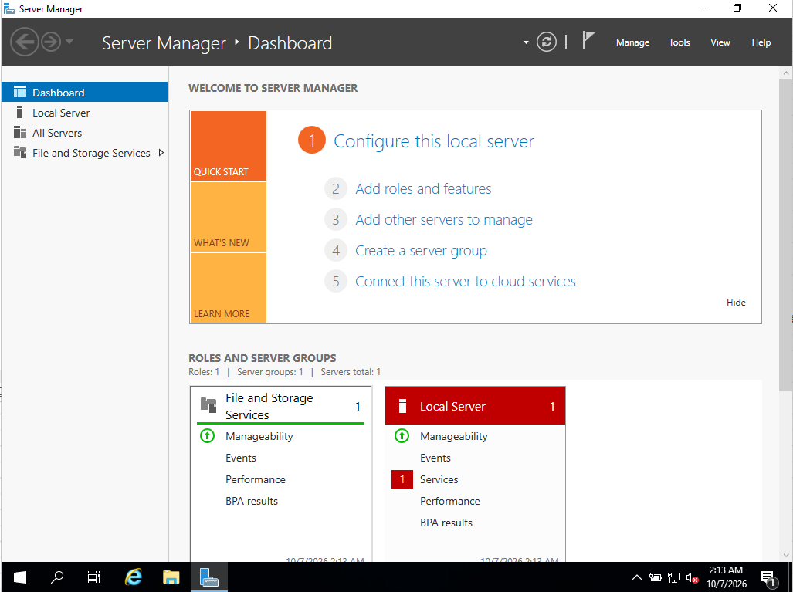
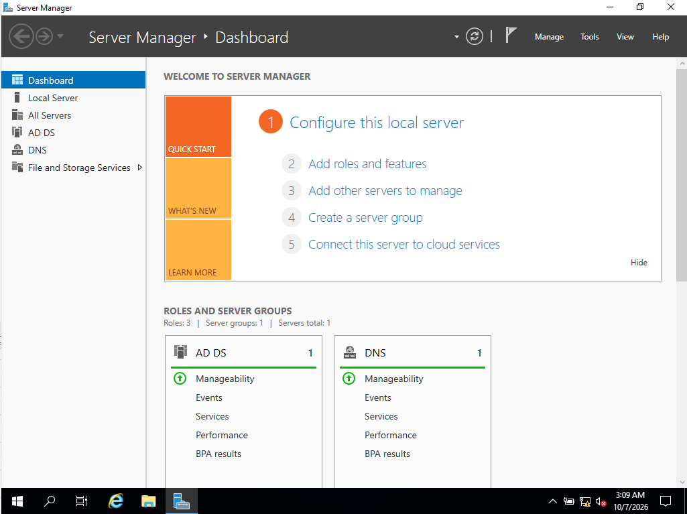
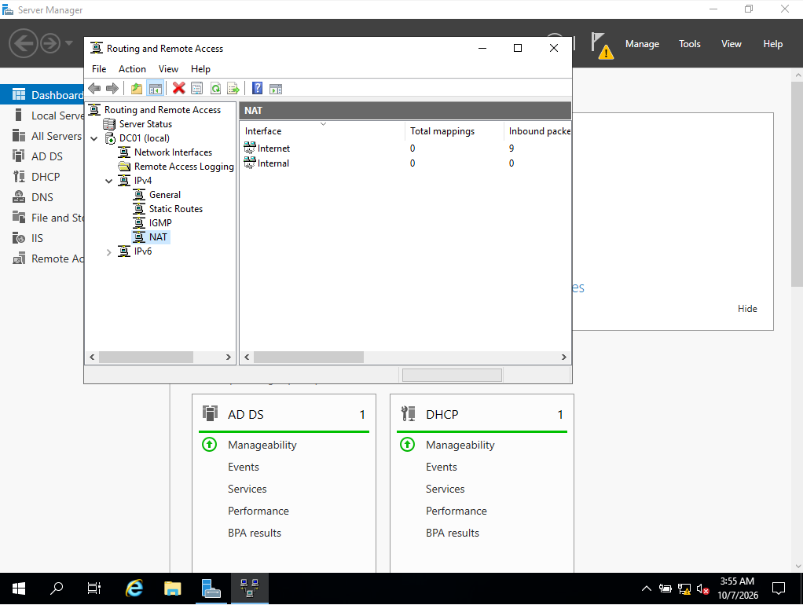
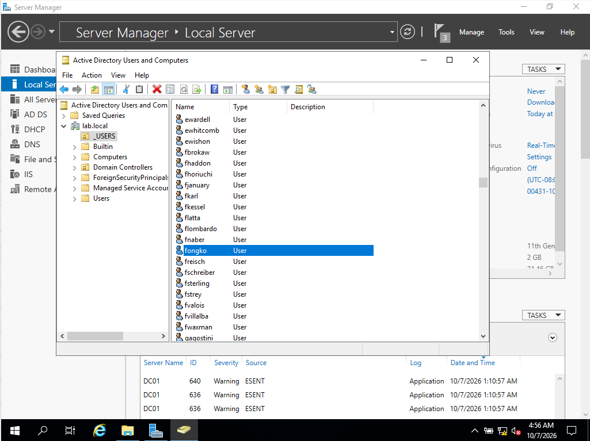

# Active Directory Home Lab: Windows Server on VirtualBox

A virtualised Windows domain environment built to practise the skills used on an IT helpdesk: directory services, DNS, DHCP, routing/NAT, and bulk user management with PowerShell.

> **Status: in progress.** The domain controller is built and working. The domain-joined client machine is the next milestone (see [Project Status](#project-status)).


## Overview

This project deploys a Windows Server domain controller (`DC01`) in VirtualBox and configures it to provide the core services of a small corporate network:

* **Active Directory Domain Services** with a new forest, `lab.local`
* **DNS** for the domain (installed with AD DS)
* **DHCP** to hand out addresses to clients on a private network
* **Routing and Remote Access (NAT)** so clients on the private network can reach the internet through the domain controller
* **Bulk user creation** with PowerShell (about 1,000 test accounts)

A Windows 10 Pro client (`CLIENT01`) is then joined to the domain to simulate a managed corporate laptop.


## Tech Stack

* **Oracle VirtualBox**: virtualisation host
* **Windows Server (evaluation ISO)**: domain controller
* **Windows 10 Pro**: domain client
* **PowerShell**: bulk user creation
* **Windows host machine**


## Architecture

Two virtual machines connected by a private VirtualBox internal network (`labnet`). The domain controller has two network adapters: one for internet access, one for the private network.

```
                  Internet
                     |
                 (VirtualBox NAT)
                     |
          +----------+-----------+
          |  DC01                |
          |  AD DS, DNS, DHCP,   |
          |  RRAS (NAT)          |
          |                      |
          |  Internet : 10.0.2.15|
          |  Internal : 172.16.0.1
          +----------+-----------+
                     |
               labnet (internal network)
                     |
          +----------+-----------+
          |  CLIENT01            |
          |  Windows 10 Pro      |
          |  IP from DHCP        |
          +----------------------+
```

|Item|Value|
|-|-|
|Domain|`lab.local`|
|Domain controller|`DC01`, internal IP `172.16.0.1` (static), no default gateway, DNS `127.0.0.1`|
|Internet adapter|VirtualBox NAT, `10.0.2.15` (automatic)|
|DHCP scope|`172.16.0.100` to `172.16.0.200`, mask `255.255.255.0`|
|DHCP options|003 Router `172.16.0.1`, 006 DNS `172.16.0.1`|
|Client|`CLIENT01`, Windows 10 Pro, receives its address from DHCP|

Both VMs use thin-provisioned disks (32 GB maximum) to fit on a machine with limited free space.


## Setup

### Prerequisites

* Oracle VirtualBox
* Windows Server evaluation ISO and Windows 10 ISO (both free from Microsoft)
* Around 50 GB of free disk space and at least 8 GB RAM

### Steps completed

1. **Create the DC01 VM.** Two network adapters: Adapter 1 = NAT, Adapter 2 = Internal Network (`labnet`). Install Windows Server (Desktop Experience) and the VirtualBox Guest Additions.
2. **Name the adapters and set the static IP.** Rename the adapters `Internet` and `Internal`, then give `Internal` the address `172.16.0.1/24` with no gateway and DNS `127.0.0.1`. Rename the server to `DC01`.
3. **Install Active Directory Domain Services** and promote the server to a domain controller with a new forest, `lab.local`. DNS is installed alongside it.
4. **Install Remote Access (Routing)** and configure **NAT** with the `Internet` adapter as the public interface.
5. **Install DHCP.** Create the scope above, set the router and DNS options, and authorize the server in Active Directory.
6. **Bulk-create users** with PowerShell. A `_USERS` OU is created and populated from a names list.
7. **Create CLIENT01** (Windows 10 Pro) on the internal network and join it to the domain. *(in progress)*


## Screenshots

**Server Manager on a fresh install**

****

**AD DS and DNS running on DC01**

****

**NAT configured in Routing and Remote Access** (Internet and Internal interfaces)

****

**Bulk-created users in the `_USERS` OU**

****


## Bulk User Creation

A PowerShell script reads a text file of names and, for each one, creates an enabled user in the `_USERS` OU. The username is the first initial plus the surname in lowercase (for example `asmith`).

How it works:

* Reads `names.txt` into an array
* Converts the lab password into a secure string
* Creates the `_USERS` organizational unit
* Loops through each name, splits it into first and last name, builds the username, and calls `New-ADUser`

Duplicate names in the list cause a few "already exists" errors. The script carries on past them.

> **Security note:** every test account shares one simple lab password and has "password never expires" set. That is acceptable in an isolated lab but would never be used in production. A real onboarding process uses a unique temporary password with "change password at next logon".


## Project Status

- [x] DC01 virtual machine built and Windows Server installed
- [x] Static IP and adapter naming configured
- [x] AD DS and DNS installed, `lab.local` forest created
- [x] NAT configured (Routing and Remote Access)
- [x] DHCP role installed, scope created
- [x] About 1,000 test users created with PowerShell
- [ ] CLIENT01 receiving an address from DHCP (currently troubleshooting, see log)
- [ ] CLIENT01 joined to `lab.local` and logged in with a domain account
- [ ] Departmental OUs and security groups
- [ ] Group Policy (password policy, drive mapping, a restriction)
- [ ] File shares with group-based permissions
- [ ] Simulated helpdesk tickets: password reset, account unlock, leaver, new starter


## Troubleshooting Log

Documentation of issues encountered and how they were diagnosed:

|Issue|Cause|Fix|
|-|-|-|
|Windows 11 client VM stuck on a black screen|Windows 11 hardware requirements (TPM, Secure Boot, EFI) and limited disk space in VirtualBox|Switched the client to Windows 10 Pro, which has no TPM requirement and uses less disk|
|Installer reported "operating system not found" after the VM was powered off|The VM was powered off before the install had finished, leaving a half-written system|Re-ran setup from the ISO, deleted the old partitions, and reinstalled|
|Mouse only moved when clicking|VirtualBox Guest Additions were not installed|Installed Guest Additions and fully shut down and restarted the VM|
|PowerShell prompted for missing parameters when creating users|Line-continuation backticks in `New-ADUser` were broken by blank lines in the pasted script|Rewrote the command using a parameter hashtable (splatting), which does not depend on line breaks|
|DHCP wizard warned the DNS address was not valid|The DNS service had not yet answered the wizard's validation query on a freshly built DC|Continued past the warning and verified DNS afterwards with `nslookup`|
|Routing and Remote Access showed an error during setup|Console was unreliable straight after the role install|The server icon showed the green "running" arrow, so verified under IPv4 > NAT that both the `Internet` and `Internal` interfaces were listed|
|Client set to the DC's IP address by mistake|Entered `172.16.0.1` on the client, causing an address conflict|Switched the client back to "Obtain an IP address automatically"|
|**Open:** client shows a `169.254.x.x` address and cannot ping the DC|Under investigation. Checking the internal network name on both VMs, DC01's static IP, and the DHCP scope/authorization/bindings|Systematically isolating with a temporary static IP and `ping 172.16.0.1` to separate network faults from DHCP faults|


## Commands Reference

|Command|Purpose|
|-|-|
|`ipconfig /all`|Show IP address, gateway, DNS, and whether DHCP is enabled|
|`ipconfig /renew`|Request a new DHCP lease (use on the client, not the DC)|
|`ping 172.16.0.1`|Test connectivity from the client to the DC|
|`ping 8.8.8.8`|Test routing/NAT out to the internet|
|`nslookup lab.local`|Test that DNS resolves the domain|
|`whoami`|Confirm the logged-in domain account|
|`services.msc`|Check DHCP, DNS, and Routing and Remote Access services are running|
|`dsa.msc`|Open Active Directory Users and Computers|
|`dhcpmgmt.msc`|Open the DHCP console|
|`ncpa.cpl`|Open Network Connections|


## What This Demonstrates

* Building and configuring a Windows domain controller from scratch
* How DNS, DHCP, and routing/NAT fit together to support Active Directory
* Virtual networking with separate internet-facing and internal adapters
* Bulk administration of directory objects with PowerShell
* Systematic network troubleshooting (`ipconfig`, `ping`, `nslookup`, service and log checks)
* Documenting problems and fixes as they happen


## Credits / Built With

* **[Josh Madakor](https://www.youtube.com/@JoshMadakor)**: this lab follows his "Active Directory Home Lab" tutorial, and the bulk user creation script and names list come from his [AD_PS repository](https://github.com/joshmadakor1/AD_PS). The script was adapted for this lab.
* **[chryber/Active-Directory-Lab-Project](https://github.com/chryber/Active-Directory-Lab-Project)**: a written walkthrough of the same lab, used as a reference for the step order.
* [Oracle VirtualBox](https://www.virtualbox.org/)
* Microsoft Evaluation Center (Windows Server and Windows 10 ISOs)

Everything beyond the base build, including the project documentation, the troubleshooting log, and planned departmental structure, Group Policy, and helpdesk ticket scenarios, is my own work.


## Notes

This is a personal lab project built for learning and portfolio purposes, not a production deployment. Default credentials and a local-only setup are intentional for this context. Before any real-world use, the environment would need unique passwords, least-privilege accounts, a proper OU and group structure, and restricted network exposure.
